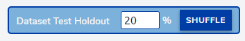
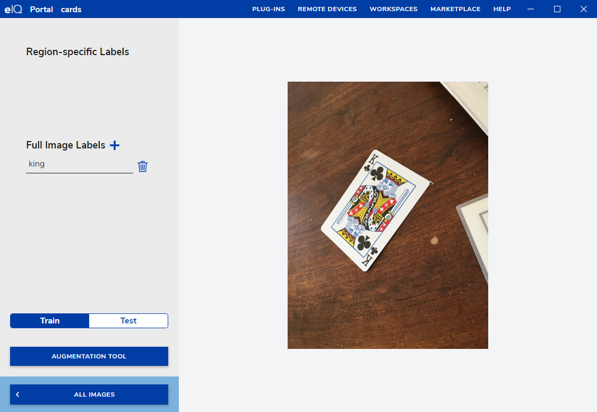
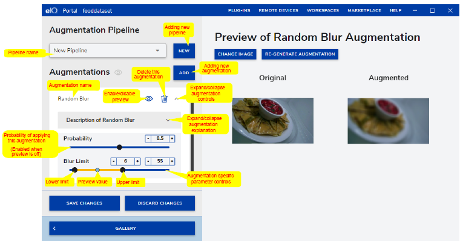
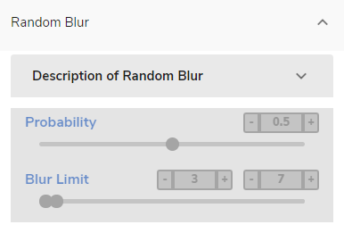

eIQ Portal
##########

The eIQ Portal is a GUI that allows the user to leverage the eIQ Toolkit capabilities in a practical and intuitive manner. With little or no knowledge of machine learning, the eIQ Portal enables the user to build models for image classification and object-detection problems.
In the eIQ Portal title bar (see Figure 2), you can find several buttons in the home screen and in the opened project screen, respectively:

* REMOTE DEVICES - opens a modal window where you can set remote devices to validate and profile your model.
* MARKETPLACE - provides information on additional services and solutions that are available from NXP and eco-system partners.
* HELP - provides the eIQ Toolkit documentation.
* WORKSPACES - (appears after opening a project) - this drop-down menu enables you to switch between the eIQ Portal sections of an opened project.
* PLUG-INS - provides information about all available converter plugins. You can check if the relevant plugin is ready and where it is located.

Home
****

In the eIQ Portal home screen, you can create a new project, open an existing one, launch the eIQ Model Tool, and open a command-line window by clicking on CREATE PROJECT, OPEN PROJECT, MODEL TOOL, and COMMAND LINE buttons, respectively.

.. image:: images/home.png
  :width: 400
  :alt: eIQ Portal: home
  :align: center

Projects
********

A project is a database that stores the data that you work with and the related information. When you import images, add labels, or generally modify the data, these changes are automatically stored in the project. All the images that you work with are stored in the project as well, so when working with a large dataset, the file size is not small.

Use the Importer command-line tool for importing bigger datasets into a project.

There are a few things to note for more advanced users:

* There are two file extensions accepted - .eiqp and .deepview. There is no difference between the two.
* Internally, a project is organized in an SQLite database.

.. note::
    While it is possible to edit files manually, it is not recommended.

Plugins
*******

Plugins are an extension to the Converter tool. The currently installed plugins allow for conversion between TF Lite, RTM, and ONNX formats, but a custom conversion can be implemented to extend the current functionality. Conversions are not only format-to-format conversions. Input and output formats can actually be the same and the plugin may do just about anything to the machine learning model internally, for example, a graph transformation or an optimization (such as quantization).

Adding a new converter plugin
=============================

Plugins are implemented as Python modules installed in the eIQ Toolkit's Python environment. To implement them, use the following folder structure:

.. code-block::

    <project_directory>
        setup.py
        converter_plugin
            assets
                image.svg or image.png
                info.html
            __main__.py
            Other files or folders

The image.svg or image.png files should have resolution of 128x128 and they show up in the eIQ Portal plugins screen. The info.html file describes the plugin details, parameters, and others. The main plugin source code file (converter_plugin.__main__.py) should implement the following functions:

* query_convert(src_type, dst_type) -> dict()
* convert(src_file, dst_file, params) -> dict()

On top of that, a standard setup.py file should also be implemented to build the wheel package. A sample setup.py script may look as follows:

.. code-block::

    from setuptools import setup,find_packages
    Package_name='<plugin_name>'
    setup(
        name='<plugin_name>',
        version='<version>',
        description='<description>',
        url='<website>',
        author='<author>',
        author_email='<author_email>',
        license='<license>',
        entry_points={'deepview_converter':
            ['converter = <package_name>.__main__']
        },
        packages=[<package_name>],
        package_data={package: ['assets\\*']},
        install_requires=
            ['<required_module>', '<another_required_module>',],
        classifiers=[],
    )

When the files and folders are created and all the required code is implemented, the plugin can be compiled within the eIQ Toolkit command line:

.. code-block::

    python setup.py bdist_wheel --universal

This creates a \*.whl file that can be installed using the following command:

.. code-block::

    deepview-converter -i <path_to_whl_file>

When the plugin is installed, it should be automatically discovered. To check that the plugin was installed successfully, run the following command:

.. code-block::

    deepview-converter -l

A plugin can also be uninstalled if needed:

.. code-block::

    deepview-converter -u <plugin_name>

Data Set Curator
****************

Data curation is the organization and integration of data collected from various sources. To open the "Data Set Curator" window, click the CREATE PROJECT or OPEN PROJECT buttons in the main menu (see Figure 2). Depending on the images that you have currently imported, the dataset curator window can look as follows:

.. image:: images/curator.png
  :width: 400
  :alt: eIQ Portal: dataset
  :align: center

The "Data Set Curator" workspace allows you to preview the images imported so far. This workspace uses a lazy loading strategy to show the images, so scroll down to see the rest.

.. note::
    If there are no images in the current project, the "Data Set Curator" window shows the "No images found" message on the screen.

Dataset import
==============

To import data into the project, the interface provides three different options that differ according to the source where the data is captured:

* IMPORT: You can browse your local machine to select multiple sample images and upload them at once.
* CAPTURE: This option utilizes a connected camera to take instantaneous images.
* REMOTE: This option allows you to capture images from a remote device.

Train-test split
================

The "Dataset Test Holdout" box in the "Data Set Curator" panel allows you to define what percentage of the collection of data in the imported data set is used for testing vs training. The selection is random and the data in the "test" set are not used in the training step. The input value corresponds to the size of the test data set. The default value is 20 %:

Dataset annotation
==================

To enable dataset annotation, click the image that you want to annotate. A good recommendation is to select the "Unlabeled Images" option in the left panel (see Figure 3) to avoid confusion between the labeled and unlabeled images. By selecting this option, you only see the images that remain unlabeled.
There are two different ways to annotate the data:

* Bounding box: labels a specific region within the image.
* Full image: assigns a label to the whole image (see Figure 5).

Now that you have selected a specific image, you can perform the annotations. By default, the "Bounding Box" selector is enabled so you can draw rectangles over the images to enclose the desired regions and label them.

The "Box" drawer also enables an input field that helps you to introduce the annotation inline. Notice that the labels are created once and they can be reutilized later. Also, you can check the annotations by moving the mouse over the label in the right panel. See how the bounding box is enclosed in a yellow rectangle. When you place the mouse over each annotation in the right panel, you can also delete that label.

During the annotation process for every image, add a new label for the entire image or select an existing one. Notice that the labels in the project are shared for both annotations ("Region-Specific Labels" and "Full Image Labels"). In this way, you can reutilize all the labels as well. To add a full image label, click the plus icon in the right panel ("Full Image Labels") and add a new label or select an existing one.

The "Train" and "Test" buttons in right panel assign the image to the training and testing datasets, respectively.

Augmentation tool
=================

The data augmentation workspace allows you to quickly adjust the image parameters to improve model training by reducing over-fitting and increasing the robustness for dynamic real-world environments. It is widely used in machine learning to diversify the training dataset (without adding more data) by transforming a percentage of existing data into a variation, as supported by the augmentation pipeline. Using these techniques, you can generate new training samples and apply simple transformations to the original data. To apply the data augmentation, click the "AUGMENTATION TOOL" button in the "Data Set Curator" menu (see Figure 3). The following screen shows the "Augmentation Pipeline" workspace with an explanation of augmentation controls:

The "Augmentation Pipeline" allows the user to combine one or more augmentation processors into a group. The default pipelines are already preset with the preset augmentations. Add a new pipeline by clicking the new button in the top left corner of the screen. Once added, you can change the name to the desired name. You can add one or more augmentations to a custom pipeline (the default pipelines cannot be edited). To do that, click the “ADD” button next the "Augmentations" area. A list with available augmentation is displayed. Click the desired augmentation to add it. The "Probability" value on each augmentation defines the percentage of images added to the training dataset with this augmentation effect. If the probability is 0.2 and if there are 100 images in the data set, then 20 images receive this augmentation in the training process per batch.

Augmentation pipelines are only executed during training. They are not used as a part of testing or validation. On top of that, for each image, for each epoch and for each step, an augmentation is generated dynamically, which means that at every epoch, the training set of images is different.

The "GENERATE NEW RANDOM AUGMENTATION" button allows you to generate a preview of how the augmented data might look like in the right-hand part of the screen.

.. note::
    If an augmentation parameter has lower and upper limits, then the parameter has a random value between these limits.

The following operators are supported by the augmentation tool:

Random Blur
-----------

Image blurring is achieved by convolving the image with a low-pass filter kernel.

It is useful to simulate an out-of-focus camera or images with low resolution.

It is useful for removing noise. It removes high-frequency content (noise, edges) from the image, which results in blurred edges when this filter is applied.

The probability slider adjusts the percentage of images that undergo this augmentation in each iteration.

The blur limit controls the kernel size in pixels.

