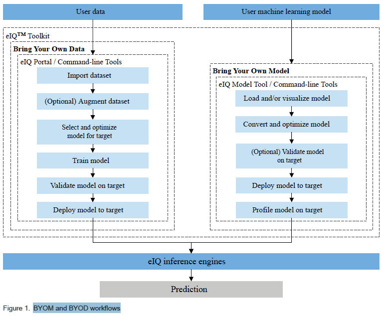

Workflows
#########

There are two approaches available with the eIQ Toolkit, based on what the user provides and what the expectations are. The following approaches are referred to throughout this document:

* Bring Your Own Data (BYOD) – the users bring image data, use the eIQ Toolkit to develop their own model, and deploy it on the target.
* Bring Your Own Model (BYOM) – the users bring a pretrained model and use the eIQ Toolkit for optimization, deployment, or profiling.

